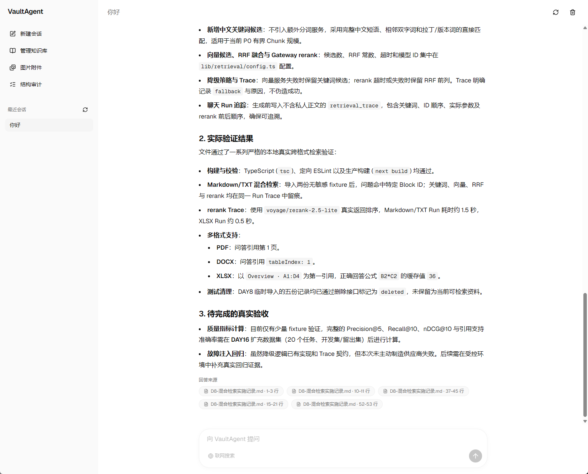
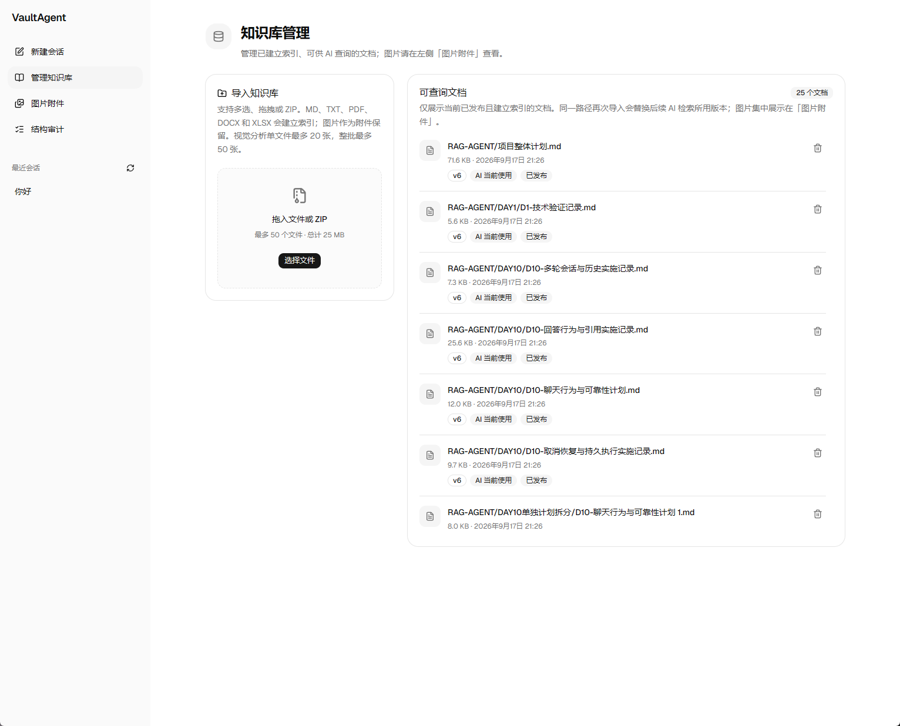
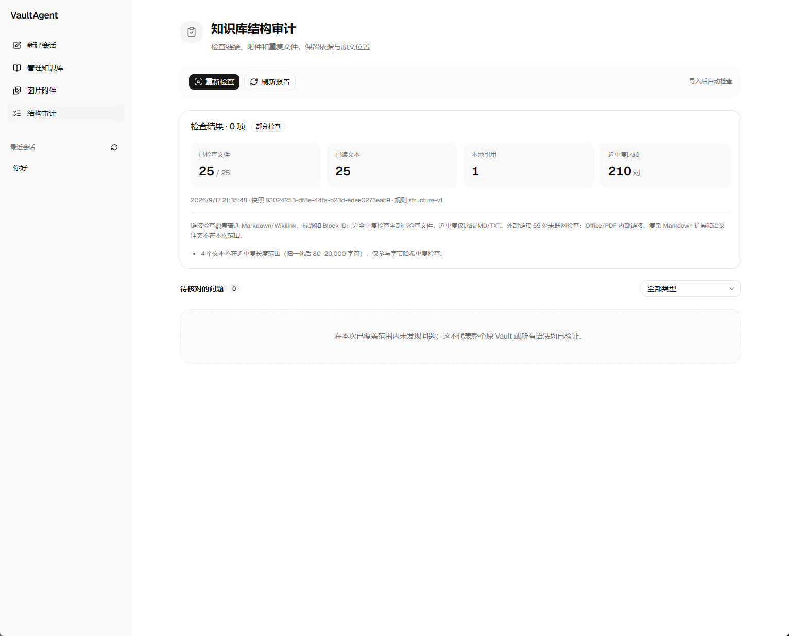
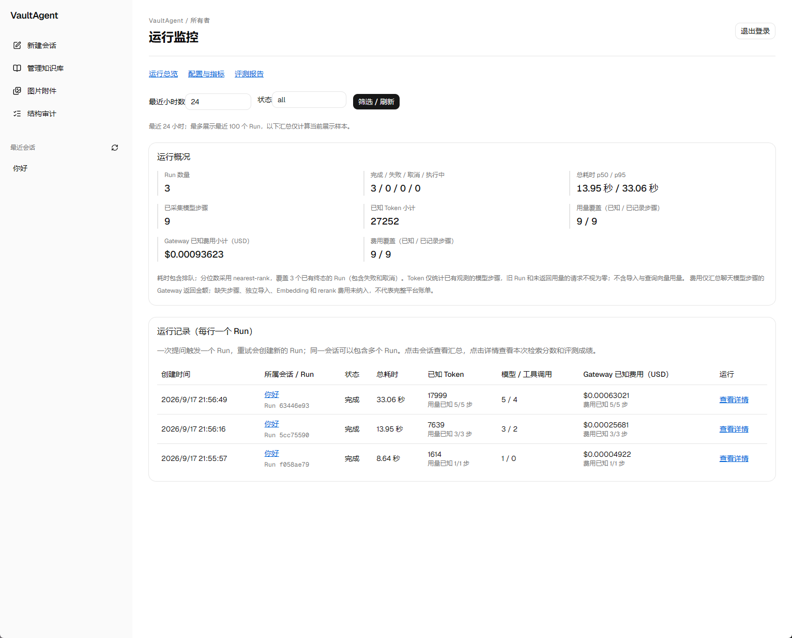
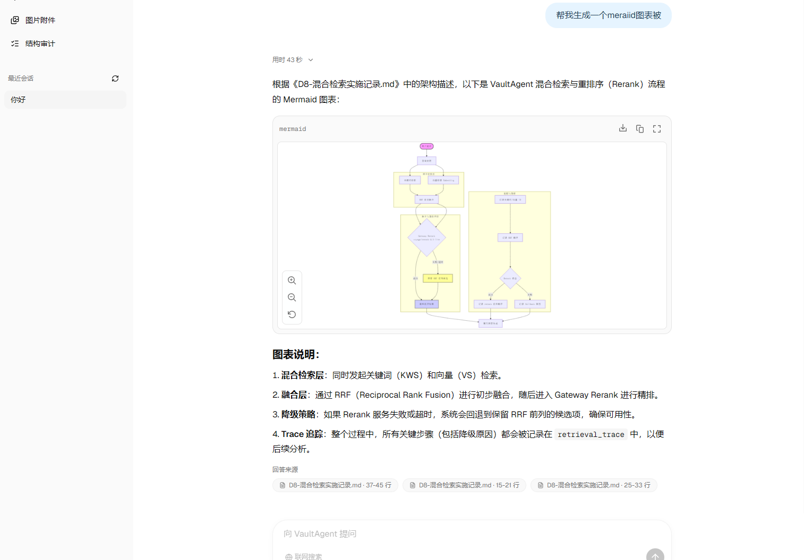
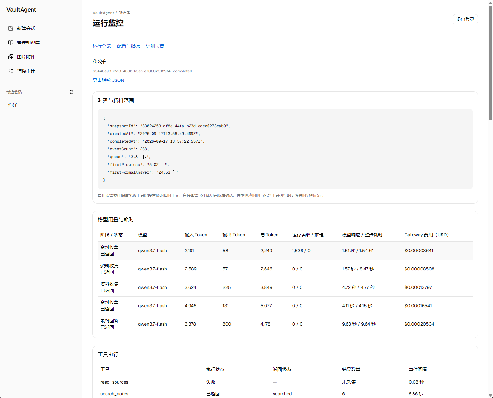

<!-- 修改时间：2026-09-18 | 文件说明：VaultAgent 品牌首页、能力说明、安装配置与安全边界 | edit by：Sliye -->

<p align="center">
  
</p>

<h1 align="center">VaultAgent</h1>

<p align="center"><strong>让个人知识库的每个回答都有证据可循</strong></p>

<p align="center">
  导入自己的笔记与文档，通过混合检索和受限 Agent 获得答案，<br />
  并回到对应的原文、页码、表格位置或图片。
</p>

<p align="center">
  
  
  
  
  
  
</p>

<p align="center">
  <a href="https://rag-agent-sliye.vercel.app">在线体验</a>
  · <a href="#-项目截图">项目截图</a>
  · <a href="#-快速开始">快速开始</a>
  · <a href="#-工作原理">工作原理</a>
  · <a href="#-隐私与安全">隐私与安全</a>
</p>

> [!IMPORTANT]
> 当前项目面向个人知识库、本地单人部署和开发验证。公开部署前，请完成身份认证、私有存储、访问隔离、配额和许可证配置。

## 为什么是 VaultAgent

很多 RAG Demo 只展示“搜到内容并生成答案”。VaultAgent 更关注完整、可追溯且可恢复的资料链路：

| 不只做什么 | VaultAgent 的处理方式 |
| --- | --- |
| 不只返回一段像答案的文本 | 最终回答只能使用本轮真实读取的本地证据或实际返回的网页摘要 |
| 不把文件名当作正文 | 文件清单只证明名称、路径、格式和数量；内容结论必须读取片段 |
| 不混用新旧资料 | 每个聊天 Run 固定到一个已发布索引快照 |
| 不隐藏失败过程 | 导入、检索、工具和生成状态均可追踪，失败不会伪装成成功 |
| 不只给出模糊来源 | 支持回到 Markdown 行、PDF 页、DOCX 段落、XLSX 区域或图片 |

## 核心能力

### 可追溯知识库问答

- 多轮聊天、消息、Run 和事件独立持久化，刷新或短暂断线后可恢复。
- 受限 Agent 只能通过已注册工具查询文件、搜索候选、读取授权片段和按需联网。
- 搜索结果必须再次读取，才能成为最终回答可引用的证据。
- 支持取消、失败状态和重新回答，不保存半截内容为成功答案。

### 多格式导入与快照

- 支持 Markdown、TXT、Obsidian Vault ZIP、PDF、DOCX、XLSX、PNG 和 JPEG。
- 原始文件先进入私有存储，再由持久化 Workflow 完成解析、视觉分析、Embedding 和快照发布。
- 文件更新不会覆盖历史引用；每轮问答固定读取当时的已发布快照。

### 混合检索与来源定位

- 中文关键词、向量检索、RRF 融合和 rerank 组合，并保留脱敏检索 Trace。
- 对错字、漏字和宽泛表达，可用少量检索假设扩大召回，但不会静默修改用户原意。
- 支持 Markdown、PDF、DOCX、XLSX 的结构化定位，以及有界图片和视觉分析结果。

### 运行观测与访问控制

- 管理侧记录模型、Token、缓存、工具、检索、耗时和 Gateway 费用。
- 本地模式面向单一所有者；GitHub OAuth 与 `OWNER_GITHUB_ID` 限制管理能力。
- 私有文件经服务端授权读取，不向浏览器暴露存储键。

## 📸 项目截图

> 截图使用演示资料。上传私人知识库前，请确认部署环境、模型提供方和访问范围。

<table>
  <tr>
    <td width="50%" align="center">
      
      <br /><sub>知识库问答与来源引用</sub>
    </td>
    <td width="50%" align="center">
      
      <br /><sub>知识库导入与快照发布</sub>
    </td>
  </tr>
  <tr>
    <td width="50%" align="center">
      
      <br /><sub>知识库结构审计</sub>
    </td>
    <td width="50%" align="center">
      
      <br /><sub>运行监控总览</sub>
    </td>
  </tr>
</table>

<details>
  <summary>查看更多运行与工具观测截图</summary>
  <br />
  <p align="center">
    
  </p>
  <p align="center">
    
  </p>
</details>

## 支持范围

| 类型 | 当前能力 | 边界 |
| --- | --- | --- |
| Markdown / TXT | 支持 | 按标题、段落、代码块等结构切块，保留位置和附件关系 |
| Obsidian Vault ZIP | 支持 | 安全解压并按相对路径导入，不回写原 Vault |
| PDF | 有限支持 | 索引文本层并保留物理页码；无文本页可在额度内视觉分析，不承诺复杂 OCR |
| DOCX | 有限支持 | 读取标题、段落、基础表格和内嵌 PNG/JPEG，不承诺复杂排版保真 |
| XLSX | 有限支持 | 读取工作表、单元格、公式缓存值和内嵌 PNG/JPEG，不等同完整 Excel 渲染 |
| PNG / JPEG | 支持 | 保存为附件，可按导入策略执行有界视觉分析 |
| 网页搜索 | 有限支持 | 由用户按需开启，仅展示本轮实际使用的少量网页来源 |

## 🔄 工作原理

```text
文件 / Vault ZIP
      │
      ▼
私有原始文件存储
      │
      ▼
Workflow：校验 → 解析 → 视觉分析 → Embedding
      │
      ▼
原子发布索引快照
      │
      ▼
聊天 Run 固定快照
      │
      ▼
关键词 + 向量 → RRF → rerank
      │
      ▼
受限工具读取证据 → 结构化回答 → 可定位来源
```

四条关键边界：

1. **文件清单不等于正文证据。** 名称、路径和数量不能证明文件内容。
2. **历史回答不等于当前证据。** 上下文用于理解追问，每轮仍需重新读取当前快照。
3. **检索候选不等于已引用来源。** 候选必须经过授权读取，才能进入最终答案。
4. **外部内容不是系统指令。** 文件与网页只作为待分析数据，不能改变权限和任务边界。

## 技术栈

| 层级 | 主要技术 |
| --- | --- |
| Web 与 UI | Next.js 16、React 19、TypeScript、Tailwind CSS、shadcn/ui、AI Elements |
| AI 编排 | Vercel AI SDK、Vercel AI Gateway、Vercel Workflow DevKit |
| 检索 | PostgreSQL、pgvector、关键词检索、RRF、Voyage rerank |
| 数据 | Drizzle ORM、PostgreSQL |
| 文件解析 | unified/remark、PDF.js、Mammoth、ExcelJS、OOXML 有界解析 |
| 文件存储 | 本地文件系统或 Vercel 私有 Blob |
| 认证 | Auth.js、GitHub OAuth |

## 🚀 快速开始

### 前置条件

- Node.js `22.x`
- pnpm `10.x`
- Docker Desktop，用于本地 PostgreSQL + pgvector
- Vercel AI Gateway Key

### 1. 克隆并安装

```bash
git clone https://github.com/ELEVENBLACK41/rag-agent.git
cd rag-agent
pnpm install
```

### 2. 创建环境文件

macOS / Linux：

```bash
cp .env.example .env.local
```

Windows PowerShell：

```powershell
Copy-Item .env.example .env.local
```

至少配置 `AI_GATEWAY_API_KEY`。本地数据库、Workflow 和文件系统存储的默认值可参考 `.env.example`。

### 3. 启动数据库并迁移

```bash
docker compose up -d
pnpm db:migrate
```

开发环境默认将 PostgreSQL 映射到 `localhost:5433`。

### 4. 启动应用

```bash
pnpm dev
```

打开 [http://localhost:3000](http://localhost:3000)，进入知识库页面导入资料。

### 常见问题

- `DATABASE_URL is required`：确认 `.env.local` 已创建，并从项目根目录启动。
- PostgreSQL 无法连接：执行 `docker compose ps`，确认容器为 `healthy`，并检查 `5433` 端口。
- 向量检索或视觉分析不可用：检查 `AI_GATEWAY_API_KEY`。
- 数据库结构不匹配：备份数据后执行 `pnpm db:migrate`，不要手动修改生产表结构。

## 环境变量

以 [`.env.example`](./.env.example) 为配置模板。不要提交 `.env.local`、连接串、OAuth Secret、Gateway Key 或真实知识库文件。

| 变量 | 本地是否必需 | 用途 |
| --- | --- | --- |
| `AI_GATEWAY_API_KEY` | 是 | 生成、Embedding、rerank 和视觉分析 |
| `DATABASE_URL` | 是 | 应用 PostgreSQL 连接串 |
| `APP_MODE` | 是 | 本地开发通常为 `local` |
| `DATA_DIR` | 文件系统存储时是 | 本地原始文件和派生资源目录 |
| `STORAGE_PROVIDER` | 是 | `filesystem` 或 `blob` |
| `WORKFLOW_TARGET_WORLD` | 是 | 本地 Workflow World 标识 |
| `WORKFLOW_POSTGRES_URL` | 是 | Workflow 使用的 PostgreSQL 连接串 |
| `BLOB_STORE_ID` | 使用 Blob 时是 | Vercel 私有 Blob Store 标识 |
| `AUTH_SECRET` | 启用认证时是 | Auth.js 会话密钥 |
| `AUTH_GITHUB_ID` / `AUTH_GITHUB_SECRET` | 启用认证时是 | GitHub OAuth 凭据 |
| `OWNER_GITHUB_ID` | 启用管理端时是 | 管理员 GitHub 数字用户 ID |
| `APP_CODE_VERSION` | 否 | 管理观测中展示的代码版本 |

## 常用命令

| 命令 | 用途 |
| --- | --- |
| `pnpm dev` | 启动本地开发服务器 |
| `pnpm build` | 创建生产构建 |
| `pnpm start` | 启动已构建应用 |
| `pnpm lint` | 执行代码检查 |
| `pnpm db:migrate` | 应用数据库迁移 |
| `pnpm db:generate` | 生成 Drizzle 迁移文件 |
| `docker compose up -d` | 启动本地 PostgreSQL |
| `docker compose down` | 停止本地 PostgreSQL，不主动删除命名卷 |

## 项目结构

```text
app/                  Next.js 页面、路由和 API 入口
components/           聊天、导入、来源、审计和通用 UI
lib/
  agent/              Agent、受限工具和执行状态
  chat/               Run 生命周期、流式事件、回答和引用校验
  ingestion/          上传校验、格式解析、ZIP 和视觉资产
  retrieval/          关键词、向量、融合和 rerank
  sources/            快照授权、来源读取和定位
  storage/            本地文件系统与私有 Blob 抽象
  monitoring/         模型、工具、检索、费用与延迟观测
  db/                 Drizzle Schema 与数据库客户端
workflows/            持久化导入与聊天执行任务
drizzle/              PostgreSQL 迁移
evals/                脱敏评测资料与说明
fixtures/             不含私人数据的格式样本
public/brand/         Logo 等项目品牌资源
public/screenshots/   README 项目截图
```

## 🔒 隐私与安全

- 本地存储不等于完全离线。使用云端生成、Embedding、rerank、视觉分析或网页搜索时，必要内容会发送给相应服务提供方。
- 原始文件只通过服务端受控读取；不要公开对象存储，也不要向客户端暴露存储键或服务端密钥。
- 生产环境必须配置 HTTPS、强随机 `AUTH_SECRET` 和明确的所有者访问控制。
- 公共体验、多用户隔离、访客数据过期、配额和滥用防护需要单独审查；当前本地模式按单人使用设计。
- ZIP 和文档的路径、大小、数量及容器均有边界校验，但不能代替恶意文件防护、备份与恢复策略。

安全问题请勿在公开 Issue 中附带密钥、私人文件或可利用细节。

## 部署说明

支持两种存储形态：

- **本地自部署**：Docker Compose 运行 PostgreSQL + pgvector，文件保存在本地私有目录。
- **Vercel 托管**：应用部署到 Vercel，搭配私有 Blob 和托管 PostgreSQL。

生产部署前至少完成：

1. 为目标环境创建独立数据库和私有文件存储。
2. 配置 Gateway、认证和生产 HTTPS 回调地址。
3. 在目标数据库执行 `pnpm db:migrate`。
4. 验证“上传 → 索引 → 提问 → 来源查看 → 删除”的完整流程。
5. 制定 PostgreSQL 与原始文件的一致备份、恢复和删除策略。

当前仓库未提供一键生产部署脚本，请根据身份认证、域名、存储与合规要求完成部署配置。

---

<p align="center">
  <strong>VaultAgent</strong> · Evidence before answers.
</p>
